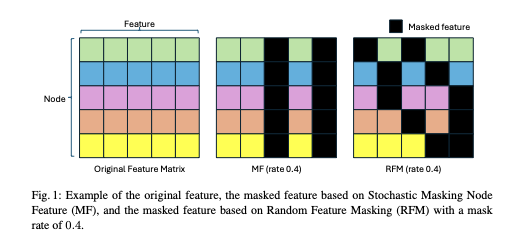

# Random_Feature_Masking

This is the repo fir Random Feature Masking (RFM).

Acknowledgment: We sincerely appreciate the authors of AUG-MAE for providing the implementation for visualizing the representation distribution. Their work has greatly facilitated our research and contributed to the advancement of our study.
